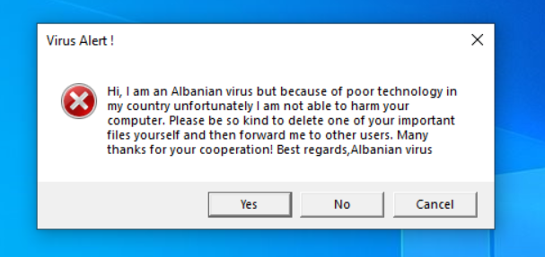
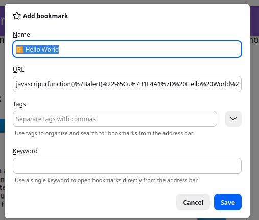
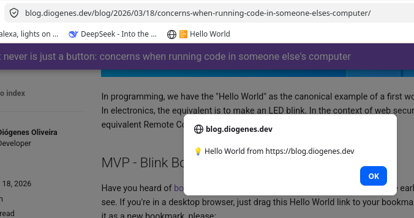

> — "There was a button", Holden said. "I pushed it."  
> — Jesus Christ. That really is how you go through life, isn't it?

## Introduction

Ever since JavaScript was introduced, we have had concerns with security issues leading to the current patchwork
of rules, headers and sandbox that browsers have had to implement reactively. After billions of dollars invested,
we have billions of devices running the best sandbox ever which is Chromium's V8. But will that ever be enough? Will
this cat and mouse game ever end? If not, why?

<!-- more -->

## POC - What's The Hello World of RCE vulnerabilities



In programming, we have the "Hello World" as the canonical example of a first working program. In electronics, the
equivalent is to make an LED blink. In the context of web security, what's the equivalent Remote Code Execution?

## MVP - Blink Bookmarklet

Have you heard of [bookmarklets](https://en.wikipedia.org/wiki/Bookmarklet)? If not, they're pretty cool remainders of the
early web, as you'll see. If you're in a desktop browser, just drag this Hello World link to your bookmarks bar and add it as a new bookmark, please:

<a href="javascript:(function()%7Balert(%60%5Cu%7B1F4A1%7D%20Hello%20World%20from%20%24%7Bwindow.location.origin%7D%60)%3B%7D)()%3B">📴 Hello World</a>

Like this:



Now as the proverbial _lyrical self_ in the Albanian Virus meme, kindly click it, please. This was the code the user was induced to run within a secure context, just kind of obfuscated through the [bookmarklet maker](https://caiorss.github.io/bookmarklet-maker/):

```javascript
alert(`\u{1F4A1} Hello World from ${window.location.origin}`);
```



### What's the catch?

Admittedly, that doesn't sound so impressive. Let's try to make a very barebones [Command and Control](https://en.wikipedia.org/wiki/Botnet#Command_and_control) server and client with this technique.
